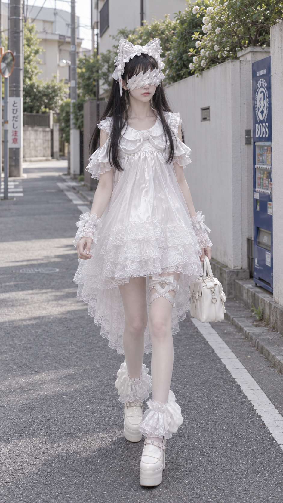
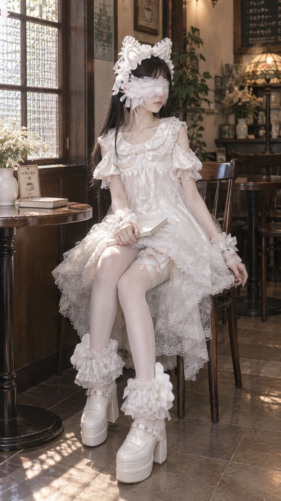
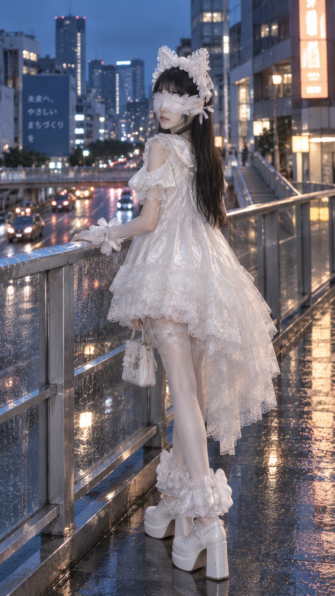
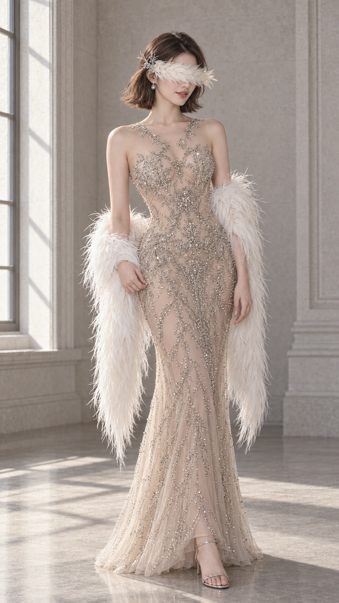
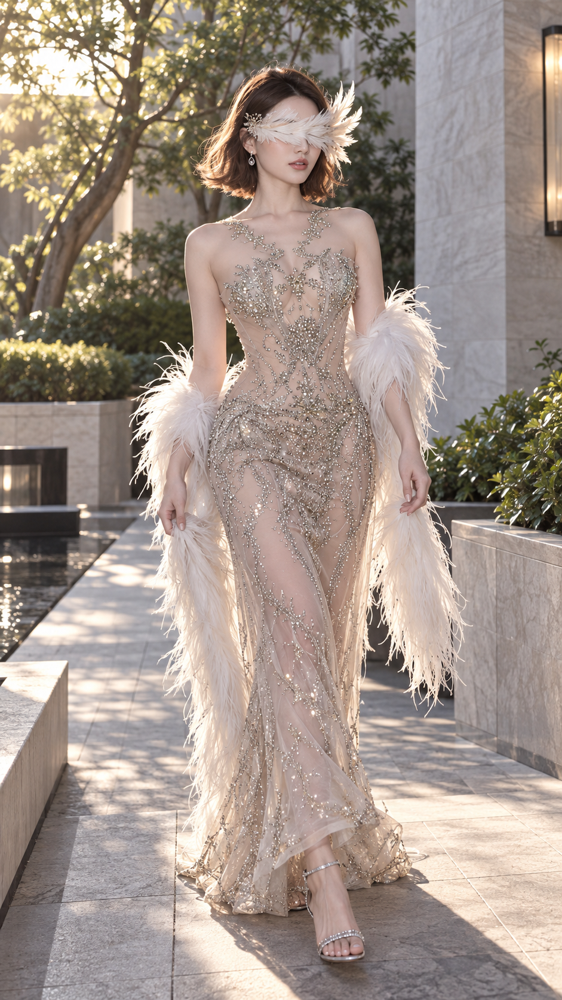
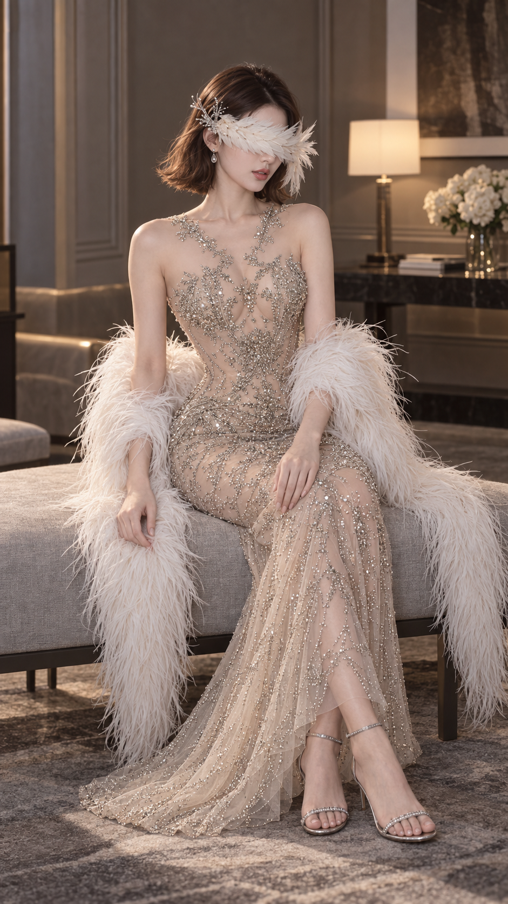
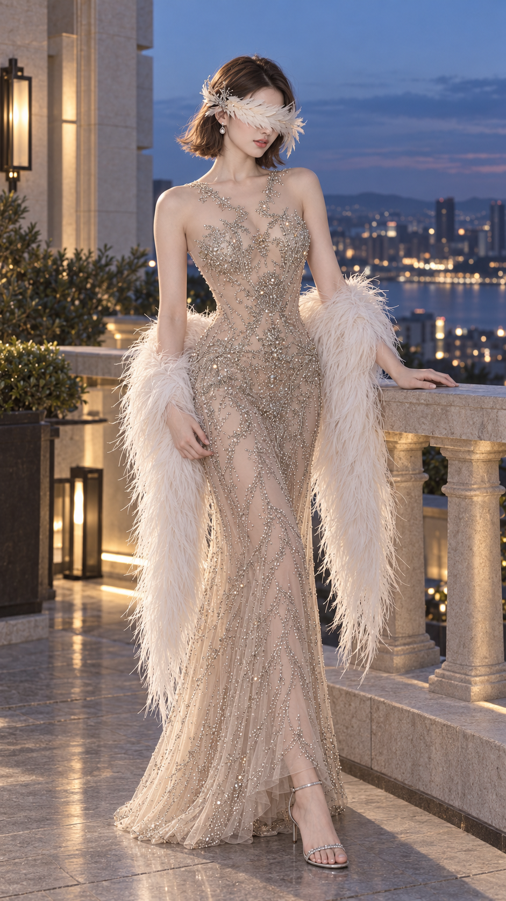

<div align="center">

# yumao 摄影

**为羽毛遮眼角色，设计完整的摄影提示词。**

中央连接四形态 · 侧源扩展 · 旧编号兼容<br>
真人 COS · 二次元 · 3D

[安装](#安装) · [使用示例](#使用示例) · [四种形态](#四种形态) · [详细文档](#详细文档)

</div>

---

## 这是什么

`yumao-photography` 是一个角色摄影提示词技能。给出角色、主题或参考图，它会组织人物造型、羽饰、动作、场景、镜头与光线，输出可独立使用的**正向提示词、负向提示词和建议参数**。

核心是由多个独立羽片组成的佩戴式眼羽：连续遮住双眼，表面与配饰不出现眼睛意象，默认居中连接，或明确选择侧源扩展（兼容旧01–10输入）；连接配饰与羽流根据服装设计。适用于明确成年的角色摄影、原创写真和造型探索。

**默认只生成提示词。** 实际出图需要另行调用图像生成工具；这不是图片生成模型，也不承诺每次成图都能满足全部结构要求。

### 白色蕾丝 · 日常写真

白色羽饰与蕾丝裙装呼应，在街巷、洗衣房、咖啡馆和雨后天桥之间切换，用自然光、室内光与城市夜色呈现同一造型的不同氛围。

| 街巷漫步 | 洗衣房 | 窗边咖啡馆 | 雨后天桥 |
| :---: | :---: | :---: | :---: |
| [](assets/gallery/white-lace-street.png) | [](assets/gallery/white-lace-laundry.png) | [](assets/gallery/white-lace-cafe.png) | [](assets/gallery/white-lace-evening.png) |

### 珠饰礼服 · 光影写真

香槟色珠饰长裙搭配浅色眼羽与羽毛披饰，从明窗、庭院到室内休憩与暮色露台，展示羽饰轮廓、服装工艺和场景光影的配合。

| 明窗肖像 | 庭院行走 | 室内坐姿 | 暮色露台 |
| :---: | :---: | :---: | :---: |
| [](assets/gallery/beaded-gown-window.png) | [](assets/gallery/beaded-gown-garden.png) | [](assets/gallery/beaded-gown-lounge.png) | [](assets/gallery/beaded-gown-terrace.png) |

*以上为历史 AI 写真展示，不作为现行四形态全部通过的证据。点击可查看原图。*

## 安装

将本仓库完整放入支持本地技能的智能体工具的技能目录，保留 `SKILL.md`、`agents/` 和 `references/` 的相对位置。

例如，在 Codex 的默认用户技能目录安装：

```sh
git clone https://github.com/RATTAN1120/yumao-photography.git ~/.codex/skills/yumao-photography
```

Windows PowerShell：

```powershell
git clone https://github.com/RATTAN1120/yumao-photography.git "$env:USERPROFILE/.codex/skills/yumao-photography"
```

如果该目录已有同名技能，请先备份或选择其他位置，避免覆盖已有修改。安装后重新开启会话，在技能列表中选择 `yumao-photography`，或输入下面的调用示例。

## 使用示例

### 从一个主题开始

```text
$yumao-photography 成年原创女性，韩系街拍，收束，n=1
```

不必一次填完所有参数。技能会补齐未指定的摄影细节，并让眼羽配色、工艺和中央饰件与服装呼应。

### 为同一角色做一组写真

```text
$yumao-photography 使用我提供的成年角色参考图，真人COS，
保持同一套服装与眼羽设计，改变动作、机位和场景，
feather_consistency_mode=strict，n=4
```

同款造型保持设计一致；动作变化会检查支撑、躯干与四肢关系，不只替换背景。具体角色默认保留所选版本的服装，换装或改编需要明确提出。

### 对比四种羽毛形态

```text
$yumao-photography 成年原创角色，同人物同衣服，
收束、开羽、垂羽、环覆各一条，保留同一配色与工艺家族
```

### 分析已有图片

附上图片后输入：

```text
$yumao-photography 检查这张图的眼羽覆盖、眼睛意象、中央连接件或侧部连接与人体连接，
说明能确认的问题，并给出完整的替换提示词
```

分析会区分图像中可见的事实与推测；参考图只用于对应维度，不把失败图当作新结构标准。

## 四种形态

[打开低保真 HTML／SVG 结构参考](references/structure-atlas.html) · [PNG 与证据登记](references/feather-form-reference.md)。默认先比较中央连接四形态；示意图不代表真实生成效果已通过。

| 形态 | 参数值 | 羽流方向 |
| --- | --- | --- |
| 收束 | `closed` | 低角度向两侧延伸，轮廓相对收敛 |
| 开羽 | `open` | 外侧增大张角，保留连续覆盖 |
| 垂羽 | `draped` | 羽流连续向下延展 |
| 环覆 | `wrap` | 向侧面与后方包覆 |

四种形态默认保留中央连接件、左右多羽片结构与适中外延；侧源只在明确选择时启用。构造定义见 [统一构造与四形态](references/form-family.md)；形态规则不等于四种都已有完整验证的成功样图。

旧编号是兼容预设，不是全部自由组合的独立维度：03已包含垂羽，06已包含主辅环覆，10归回材料探索。编号选择见 [用户手册](USER_GUIDE.md)，结构定义见 [侧源非对称布局](references/side-origin-layouts.md)。眼羽材质支持天然羽、金属、织物、琉璃及元素化设计，均须保留多羽片结构和完整遮眼。

## 常用设置

| 设置 | 默认值 | 用途 |
| --- | --- | --- |
| `eye_feather_layout` | `centered` | 默认中央连接，可明确选择侧源旧预设 |
| `n` | `1` | 独立提示词数量 |
| `ratio` | `9:16` | 画面比例，可指定 `4:5` 等 |
| 输出尺寸 | 平台默认或自动 | 不自动添加8K、超高清等标签；明确尺寸要求按工具能力处理 |
| `output_mode` | `full` | `concise` 可缩短输出，保留关键结构 |
| `feather_consistency_mode` | `adaptive` | 同造型保持设计，允许的换装重新适配 |

强调同一方案时使用 `strict`；探索未锁定的造型时使用 `free`。这些设置不会覆盖你明确指定的服装、形态或材质。

每条结果包含：**01｜角色或主题 · 方案名称 → 正向提示词 → 负向提示词 → 建议参数**。首行不加字段前缀，单套也编号，修订保留对应序号。默认使用自然、准确的中文描述对象、位置与结构关系，支持指定其他语言；批量结果逐条完整展开。

提示词默认仅在对话中交付；明确要求保存或导出时才写入文件。

## 详细文档

- [用户手册](USER_GUIDE.md)：快速上手、布局编号选择与反馈方法。

- [技能完整规则](SKILL.md)：身份、服装、摄影、输出与检查流程。
- [独立交付与描述一致性](references/prompt-handoff.md)：跨工具使用、材质与光影配合、参考依赖及组图固定项检查。
- [用法与数量规则](references/usage.md)：调用方式、组图一致性与数量解释。
- [羽饰构造](references/form-family.md) · [尺寸规则](references/feather-scale.md)：四形态与尺度依据。
- [负面约束](references/negative-prompts.md) · [眼羽问题诊断](references/eye-seam-repair.md) · [人体一致性](references/anatomy-integrity.md)：常见失败与检查方法。
- [参考图登记](references/feather-form-reference.md) · [案例证据](references/case-evidence.md)：各图的用途、已知限制与正反例。

参考图按结构、尺寸或诊断用途保留，不能视为全部通过现行规则的作品展示。
